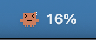
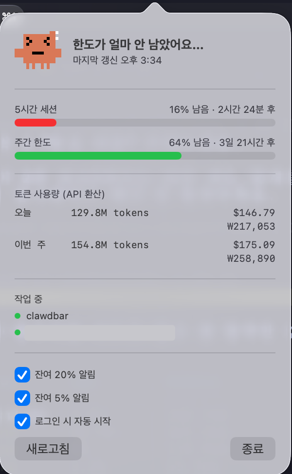

# Claude Bar 🦞

A cute pixel-art menu bar widget for macOS that shows your Claude Code usage at a glance — starring **Clawd**, the little orange mascot.

   
  

## Features

- 📊 **Plan limits**: 5-hour session & weekly limit remaining (same data as `/usage`), color-coded gauges
- 🦞 **Clawd moods**: 6 pixel faces that change as your limit runs out — and Clawd bounces while Claude Code is working
- 🔢 **Token stats**: today / this week token counts with API-equivalent cost in USD and KRW, parsed locally from `~/.claude/projects`
- 🔔 **Fun notifications**: threshold alerts at 20% / 5%, and a "go home" message when you hit the limit
- 🚀 **Launch at login**, lightweight native app (SwiftUI + AppKit, zero dependencies)

## Install

### Homebrew (recommended)

    brew tap ParkBeomMin/claude-bar https://github.com/ParkBeomMin/claude-bar
    brew install claude-bar
    claude-bar &

### From source

    git clone https://github.com/ParkBeomMin/claude-bar && cd claude-bar
    make run

## Requirements & permissions

- macOS 13+, Claude Code logged in (Pro/Max plan for limit data)
- On first launch macOS asks for **Keychain access** — ClaudeBar reads the OAuth token
  Claude Code stored, to call the same usage endpoint the `/usage` command uses.
  The token never leaves your machine except to `api.anthropic.com`.
- Notification permission is requested on first launch (optional).

## How it works

- Plan limits: `GET https://api.anthropic.com/api/oauth/usage` with the OAuth token
  from the macOS Keychain (service `Claude Code-credentials`). Polled every 120s (60s while active), with automatic backoff on rate limits.
- Token stats: local parse of `~/.claude/projects/**/*.jsonl` (never uploaded anywhere).
- Activity: a session file modified in the last 30s means Claude is working → bounce!

## License

MIT

---

### 한국어

Claude Code 사용량을 메뉴바에서 귀엽게 보여주는 위젯입니다. 5시간 세션/주간 한도 잔여량,
오늘·이번 주 토큰 사용량(API 환산 비용), 작업 중 애니메이션, 한도 소진 시 퇴근 알림을 지원해요.
설치는 위 Homebrew 명령어를 사용하세요.
